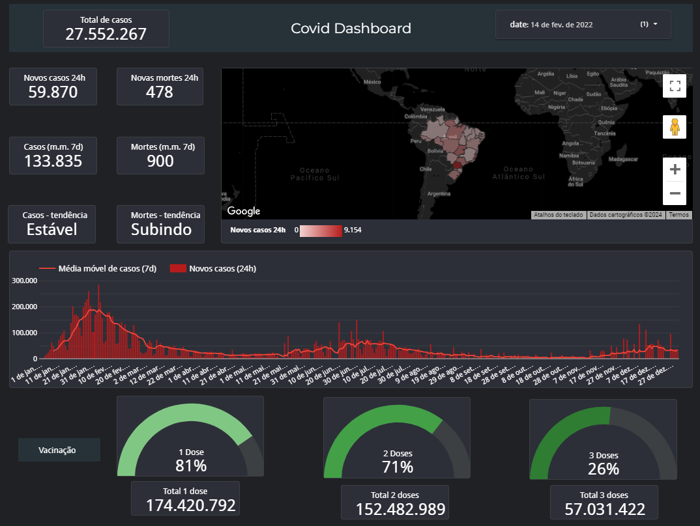

# Analise de dados de casos e vacinação

O projeto tem como base a extração, tratamento e análise dos dados referente a casos e vacinação da covid-19 no ano de 2022

## Módulos e pacotes

- math
- typing
- datetime
- numpy
- pandas

Visual do dashboard criado pelo programa Google Data Studio que podew ser acessado pelo link: https://lookerstudio.google.com/reporting/77b1dedd-a5b1-44da-83ab-535276e1113e

